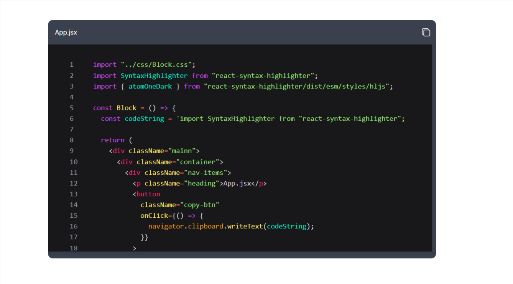

# Project Preview Sample (CURRENT)



# Project Name

Codeblock

## Introduction

This project is built using React and Vite, with additional dependencies for development and production environments. This README.md file will guide you through setting up the project locally.

## Prerequisites

Make sure you have Node.js and npm (or yarn) installed on your machine.

## Installation

1. Clone the repository to your local machine:

   ```bash
   git clone <repository-url>
   ```

2. Navigate to the project directory:

   ```bash
   cd project-directory
   ```

3. Install dependencies:

   ```bash
   npm install
   ```

   or if you're using yarn:

   ```bash
   yarn install
   ```

4. Install this:

   ```bash
   npm install rehype-pretty-code shiki
   ```

   or if you're using yarn:

   ```bash
   yarn install rehype-pretty-code shiki
   ```

## Dependencies

### Production Dependencies

- **React**: "^18.2.0"
- **React DOM**: "^18.2.0"
- **Rehype Pretty Code**: "^0.13.1" (ADDED)
- **rehype-react**: "^8.0.0" (ADDED)
- **rehype-stringify**: "^10.0.0" (ADDED)
- **remark-parse**: "^11.0.0" (ADDED)
- **remark-rehype**: "^11.1.0" (ADDED)

### Development Dependencies

- **@types/react**: "^18.2.66"
- **@types/react-dom**: "^18.2.22"
- **@vitejs/plugin-react**: "^4.2.1"
- **ESLint**: "^8.57.0"
- **ESLint Plugin React**: "^7.34.1"
- **ESLint Plugin React Hooks**: "^4.6.0"
- **ESLint Plugin React Refresh**: "^0.4.6"
- **Vite**: "^5.2.0"
- **Shiki**: "^1.3.0" (ADDED)

## Usage

After installing dependencies, you can start the development server using Vite:

```bash
npm run dev
```

or

```bash
yarn dev
```

This will start the development server at `http://localhost:3000`.

## Additional Information

- Make sure to configure ESLint according to your preferences in the `.eslintrc` file.
- For further customization, refer to the Vite documentation: [Vite Docs](https://vitejs.dev/).

---

- Word Highlighting - https://rehype-pretty.pages.dev/
- https://github.com/shikijs/shiki
- https://www.radix-ui.com/primitives/docs/components/collapsible
- https://ui.aceternity.com/components/sparkles
- [{filename:"index.css",codestring:"console.log("hello world!!")"},{..}]
- https://ui.aceternity.com/components/sparkles
- https://www.radix-ui.com/themes/docs/theme/dark-mode
